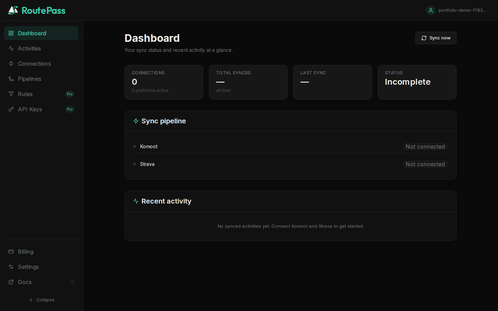
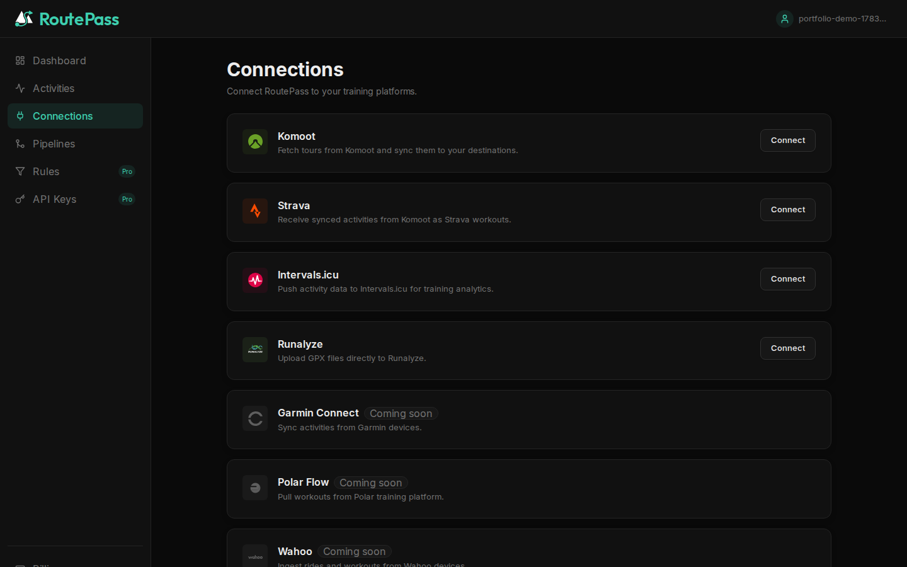
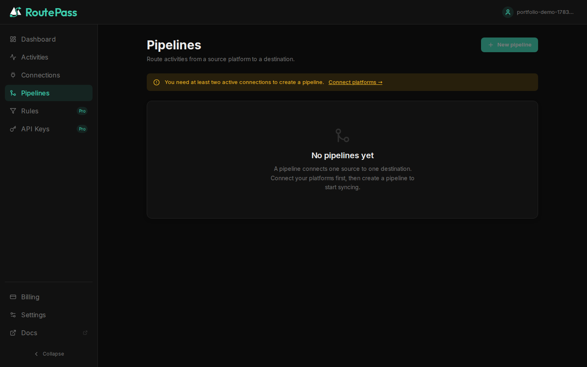

# RoutePass

<!-- portfolio:date=2026-04-15 -->

<p align="center">
  
</p>

## Overview

RoutePass is a sync hub for fitness platforms — connect Strava, Komoot, Garmin, Intervals.icu and more, then route every new activity between them via configurable pipelines and rules.

Every platform is a peer: the same activity can fan out to several destinations, or several sources can funnel into one, with per-pipeline rules (sport type, distance, elevation, name) deciding what gets transformed, renamed, or skipped along the way.

It grew out of a much narrower tool — a single-purpose Komoot→Strava sync script — into a multi-tenant FastAPI backend with a Next.js dashboard, async background workers, and a rule engine that treats "source" and "destination" as interchangeable roles rather than fixed directions.

<p align="center">
  
  
  
</p>

## Features

- **Any source, any destination** — Strava, Komoot, and Intervals.icu/Runalyze/Garmin can each act as source or destination for a pipeline; no hardcoded direction.
- **Multi-pipeline routing** — fan one source out to several destinations, or fold several sources into one, with an independent rule chain per pipe.
- **Rule engine** — filter and transform activities per pipeline by sport type, distance, elevation, or name before they're pushed downstream.
- **Rate-limit safe** — all outbound Strava calls go through a shared, Redis-backed rate limiter (`RateLimitGuard`) so one busy user can't exhaust the app's API quota for everyone else.
- **Privacy by design** — Komoot credentials and Strava tokens are encrypted at rest (AES-256 Fernet); GPX downloads use short-lived presigned URLs instead of streaming through the API; GDPR data export and account deletion are built in, with an audit log that survives account deletion for compliance.
- **Self-hostable** — MIT-licensed. `DEPLOYMENT_MODE=selfhosted` strips billing/tier gating entirely so a single-instance deploy runs with all features unlocked, using your own Strava API app.
- **REST API + webhooks** — programmatic access via API keys, plus outbound signed webhooks and inbound Strava push-event handling for real-time sync instead of polling.

## Tech stack

**Backend** — FastAPI (async) · SQLAlchemy 2.0 (async, PostgreSQL) · Alembic · Redis + ARQ (background jobs) · JWT auth · Fernet encryption

**Frontend** — Next.js 15 (App Router) · TypeScript · Tailwind CSS · React Query · Framer Motion

**Infra** — Docker Compose · Coolify · self-hosted on Hetzner, this instance running in `selfhosted` deployment mode as a public demo

## Try it

The public instance at [routepass.online](https://routepass.online) runs this repository's `main` branch in self-hosted mode: register for free, connect Strava, and set up a pipeline. Billing/tier gating is disabled on this demo — every feature is unlocked.

## Quick Start (local development)

### 1. Create an env file

```bash
cp .env.saas.template .env.saas
```

Fill in the required variables (`SECRET_KEY`, `KOMOOT_ENCRYPTION_KEY`, `STRAVA_CLIENT_ID`/`STRAVA_CLIENT_SECRET` from a [Strava API app](https://www.strava.com/settings/api)).

### 2. Start the stack

```bash
make dev       # api + worker + db + redis + frontend
make dev-logs
```

### 3. Run checks

```bash
make check     # ruff + mypy + pytest
```

## Useful Commands

```bash
make status       # Git status + log
make dev          # Start docker stack
make dev-stop     # Stop docker stack
make test         # Run pytest
make lint         # Run ruff checks
make check        # lint + test
make migrate      # Run alembic migrations
```

## Architecture Notes

- FastAPI async API with SQLAlchemy 2.0 async ORM (PostgreSQL)
- Redis + ARQ workers for background sync jobs (`poll_user_sources`, per-connection watermarks, real-time Strava webhook ingestion)
- All outbound Strava calls guarded by `RateLimitGuard` (shared quota, multi-app fan-out)
- Komoot's API is unofficial and unauthenticated by OAuth — credentials are encrypted with AES-256 Fernet, never stored in plaintext
- GPX object storage is pluggable: DB column by default (self-hosted), S3/R2-compatible for larger deployments

## Repository Documentation

- `AI_HANDOFF.md`: current implementation state, migration chain, test coverage
- `IMPLEMENTATION_PLAN.md`: full launch plan (scalability, deployment, privacy, multi-directional sync)
- `docs/setup_guide.md`: user account-linking guidance
- `docs/PROJECT_LEGACY.md`: original single-user tool this project grew out of

## License

MIT — see [LICENSE](LICENSE).
